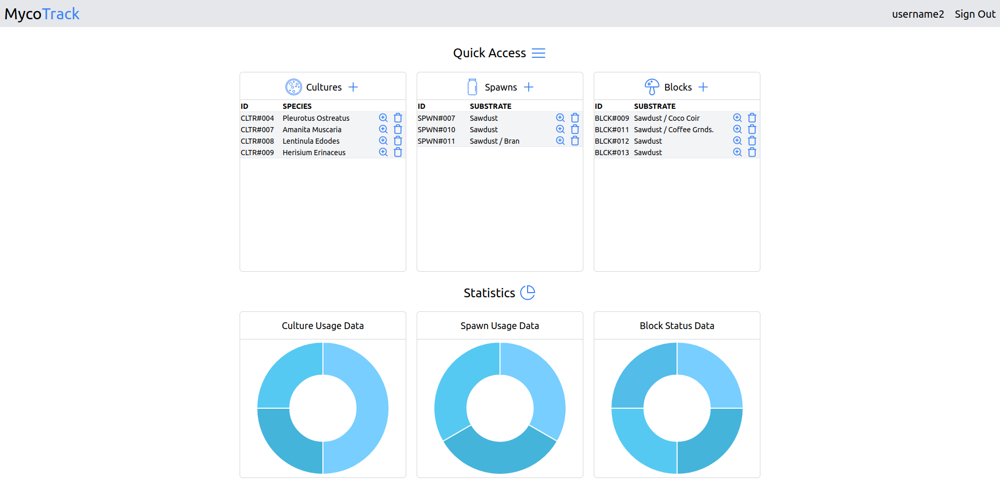

<p align="center" width="100%">
    
</p>

<h3 align="center">MycoTrack</h3>

  <p align="center">
    A Vue.js and Rails app for tracking mycelium samples.
    <strong>This project is currently not being maintained!</strong>
    <br />
    <br />
    <a href="https://github.com/erayalkis/mycotrack/issues">Report Bug</a>
    ·
    <a href="https://github.com/erayalkis/mycotrack_frontend">View Frontend Repo</a>
    ·
    <a href="https://github.com/erayalkis/mycotrack/issues">Request Feature</a>
  </p>

# About MycoTrack:



<br />

`MycoTrack` is a simple to use, efficient, and developer friendly app for tracking your mycelia.

## Features:

- Live statistics for your data.
- Fluid and responsive UI.
- Easy login/signup flow.
- Interactive notification system.
- Single page design for maxiumum efficiency.

MycoTrack focuses on keeping things simple, so that you can focus on your data.

# Developers:

## Local setup

Clone both the backend and the frontend:

```
  git clone git@github.com:erayalkis/mycotrack.git
```

```
  git clone git@github.com:erayalkis/mycotrac_frontend.git
```

### Setting up the backend

Navigate to the backend folder:

```
  cd mycotrack
```

Install gems using bundler:

```
  bundle install
```

Create database:

```
  rails db:create
```

Run migrations:

```
  rails db:migrate
```

In your credentials file, add a `devise_jwt_secret_key` key and set a secret as its value.
To generate a secret, run:

```
  rails secret
```

And finally, run the server!

```
  rails server
```

### Setting up the frontend

Navigate to the frontend folder:

```
  cd mycotrack
```

Install npm packages:

```
  npm install
```

Run the frontend server:

```
  npm run dev
```

# License

Licensed under the [MIT License](https://github.com/erayalkis/mycotrack/blob/main/LICENSE)
